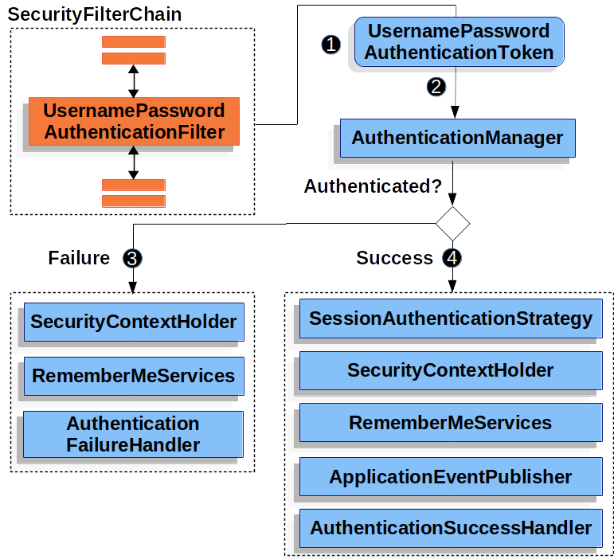
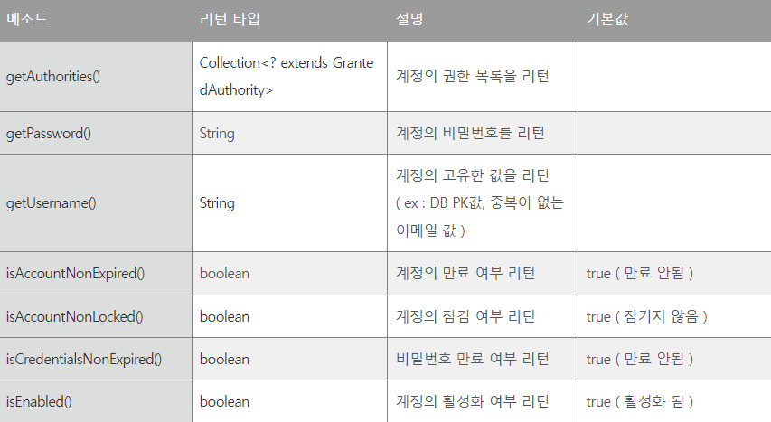

# Spring Security 
참고 강의 : [Spring Boot and Spring Security with JWT including Access and Refresh Tokens](https://www.youtube.com/watch?v=VVn9OG9nfH0&list=LL&index=2&t=2995s)
## 1. init: project setting
java : 17<br>
gradle<br>
spring boot version : 2.6.9
```groovy
dependencies {
	implementation 'org.springframework.boot:spring-boot-starter-data-jpa'
	implementation 'org.springframework.boot:spring-boot-starter-security'
	implementation 'org.springframework.boot:spring-boot-starter-web'
	compileOnly 'org.projectlombok:lombok'
	developmentOnly 'org.springframework.boot:spring-boot-devtools'
	runtimeOnly 'mysql:mysql-connector-java'
	annotationProcessor 'org.projectlombok:lombok'
	testImplementation 'org.springframework.boot:spring-boot-starter-test'
	testImplementation 'org.springframework.security:spring-security-test'
}
```

## 2. feat: user, role 로직 작성
security 진행에 앞서 필요한 도메인과 관련 레이어 로직들을 작성한다.
### 도메인 생성(Role, User)
```java
@Entity
@Data
@NoArgsConstructor
@AllArgsConstructor
public class Role {
    @Id
    @GeneratedValue(strategy = GenerationType.AUTO)
    private Long id;
    private String name;
}
```

```java
@Entity
@Data
@NoArgsConstructor
@AllArgsConstructor
public class User {
    @Id
    @GeneratedValue(strategy = GenerationType.AUTO)
    private Long id;
    private String name;
    private String username; // john123 or email 도 String 이므로 가능하다
    private String password;

    @ManyToMany(fetch = FetchType.EAGER) // 사용자를 불러올때마다 db 에서 역할을 가지고 올 것이다.
    private Collection<Role> roles = new ArrayList<>();
}
```
### 레포지토리, 서비스, 컨트롤러 생성
- Repository : JpaRepository 를 이용
- Service:
  - saveUser,saveRole,addRoleToUser,getUser,getUsers

## 3. feat: authentication 설정 추가
UsernamePasswordAuthenticationFilter 를 활용하여 CustomAuthenticationFilter 를 작성한다.
- UsernamePasswordAuthenticationFilter : Form based Authentication 방식으로 인증을 진행할 때 아이디, 패스워드 데이터를 파싱하여 인증 요청을 위임하는 필터이다.
- 유저가 로그인 창에서 Login을 시도할 때 보내지는 요청에서 아이디(username)와 패스워드(password) 데이터를 가져온 후 인증을 위한 토큰을 생성 후 인증을 다른 쪽에 위임하는 역할을 하는 필터이다.
- request안에서 username, password 파라미터를 가져와서 UsernamePasswordAuthenticationToken 을 생성 후 AuthenticationManager을 구현한 객체에 인증을 위임한다.


### authenticationfilter 작성
```java
@Slf4j
public class CustomAuthenticationFilter extends UsernamePasswordAuthenticationFilter {
    private final AuthenticationManager authenticationManager;

    public CustomAuthenticationFilter(AuthenticationManager authenticationManager) {
        this.authenticationManager = authenticationManager;
    }

    @Override
    public Authentication attemptAuthentication(HttpServletRequest request, HttpServletResponse response) throws AuthenticationException {
        // parameter 로 username 과 password 를 전달 받는다.
        String username = request.getParameter("username");
        String password = request.getParameter("password");
        log.info("Username is: {}", username);
        log.info("Password is: {}", password);
        // token 을 생성한다.
        UsernamePasswordAuthenticationToken authenticationToken = new UsernamePasswordAuthenticationToken(
            username, password);
        // username 과 password 를 담아 token 화 시킨 후
        // authenticationManager 에게 인증을 요청한다.

        return authenticationManager.authenticate(authenticationToken);
    }
    
    @Override
    protected void successfulAuthentication(HttpServletRequest request, HttpServletResponse response, FilterChain chain, Authentication authResult) throws IOException, ServletException {
        // 로그인 성공시 사용자에게 토큰 - 액세스 토큰과 refresh 토큰을 제공해야 한다.
        super.successfulAuthentication(request, response, chain, authResult);
    }
}
```
### UserDetailsService
```java
public interface UserDetailsService {
	UserDetails loadUserByUsername(String username) throws UsernameNotFoundException;
    // 유저의 정보를 불러와서 UserDetails로 리턴
}
```
- UserDetailsService : Spring Security에서 유저의 정보를 가져오는 인터페이스이다.
- UserDetails : Spring Security에서 사용자의 정보를 담는 인터페이스
  

### security configure 설정
- `WebSecurityConfigurerAdapter`를 상속받은 `config` 클래스에 `@EnableWebSecurity` 어노테이션을 달면 `SpringSecurityFilterChain` 이 자동으로 포함됩니다.
- 그 후 `configure` 를 오버라이딩 하여 접근 권한을 작성한다.
- 다음 코드를 보면 `UserDetailsService` 과 의존성을 가지는 것을 알 수 있다. `UserDetailsService` 를 통해 Spring Security 에서 사용자의 정보를 `UserDetails` 로 가지고 오게 되고 이를 활용하여 로직을 작성한다.
- 사용 로직은 사용자 저장소를 설정하는 것이다. 오버라이딩 된 첫번째 configure 에서 JPA 를 활용하기 떄문에 `auth.userDetailsService` 를 사용하고 비밀번호 암호화를 진행한다.
- `BCryptPasswordEncoder` 는 비밀번호를 암호화하는 데 사용할 수 있는 메서드를 제공한다. db 저장시 암호화과정을 거친 비밀번호를 저장하게 한다.
```java
@Configuration
@EnableWebSecurity
@RequiredArgsConstructor
public class SecurityConfig extends WebSecurityConfigurerAdapter {
    private final UserDetailsService userDetailsService;
    private final BCryptPasswordEncoder bCryptPasswordEncoder;

    // 사용자 저장소를 설정. imMemory 등 다양한 메소드들이 있지만 JPA 를 활용하기 때문에
    // userDetailsService 를 활용한다. 이때 비밀번호 암호화를 진행한다.
    @Override
    protected void configure(AuthenticationManagerBuilder auth) throws Exception {
        auth.userDetailsService(userDetailsService).passwordEncoder(bCryptPasswordEncoder);
    }

    @Override
    protected void configure(HttpSecurity http) throws Exception {
        http.csrf().disable(); // csrf 를 사용하지 않는다.
        http.sessionManagement().sessionCreationPolicy(SessionCreationPolicy.STATELESS); // 세션을 사용하지 ㅇ낳는다.
        http.authorizeRequests().anyRequest().permitAll(); // 이순간 누구나 접근 가능
      // 만들어둔 인증 filter 를 추가한다. 이때 생성자에 필요한 객체는 bean 으로 등록하여 전달한다.
        http.addFilter(new CustomAuthenticationFilter(authenticationManagerBean())); 
    }

    @Bean
    @Override
    public AuthenticationManager authenticationManagerBean() throws Exception{
        return super.authenticationManagerBean();
    }

    @Bean
    PasswordEncoder passwordEncoder(){
      return new BCryptPasswordEncoder();
    }
}
```

### UserService 에 UserDetailsService 를 implements 
- username 을 통해 User 를 찾는다. 이떄 user 가 존재하지 않으면 에러를 발생시킨다.
- 존재하는 경우 String 으로 설정되어있던 role 를 SimpleGrantedAuthority 로 변경하여 spring.core 에 있는 User 즉 Security 에서 활용되는 User 객체에 담아 생성하여 return 한다.
- spring security 는 UserDetailsService 를 통해 UserDetails 에 유저 정보를 가지고 오는데 이때 이 메서드를 통해 db 에서 데이터를 가지고 오게 된다.
```java
public class UserServiceImpl implements UserService, UserDetailsService {
    private final UserRepo userRepo;
    private final RoleRepo roleRepo;

    @Override
    public UserDetails loadUserByUsername(String username) throws UsernameNotFoundException {
        User user = userRepo.findByUsername(username);
        if(user == null){
            log.error("User not found in the database");
            throw new UsernameNotFoundException("User not found in the database");
        }else{
            log.error("User found in the database: {}", username);
        }
        Collection<SimpleGrantedAuthority> authorities = new ArrayList<>();
        user.getRoles().forEach(role -> {
            authorities.add(new SimpleGrantedAuthority(role.getName()));
        });

        return new org.springframework.security.core.userdetails.User(user.getUsername(), user.getPassword(), authorities);
    }
    
    @Override
    public User saveUser(User user) {
      log.info("Saving new user {} to the database", user.getName());
      user.setPassword(passwordEncoder.encode(user.getPassword())); // 비밀번호를 인코딩한다.
      return userRepo.save(user);
    }
  ...
```

## 4. feat: access_token, refresh_token 추가
### auth0:java-jwt 의존성 추가
```groovy
	implementation 'com.auth0:java-jwt:3.19.2'
```

### customAuthenticationFilter 에서 로그인 성공 시 access_token, refresh_token 응답
- Authentication 에서 로그인에 성공시 클라이언트에게 `access_token` 과 `refresh_token` 을 전달해야 한다.
- 로그인 성공시 db 에서 가지고온 `User` 객체를 `authentication` 을 통해 가지고 올 수 있다.
- 가지고 온 `User` 는 `UserDetails` 의 구현체로 정보를 리턴하는 메서드들을 활용할 수 있다.(위 그림 참조)
- 토큰 생성은 `JWT.create()` 를 통해 생성가능하다.
- `Subject` 는 사용자를 식별할 수 있는 고유값이어야 한다.
- `ExpiresAt` 는 만료시간으로 어플리케이션의 성격에 따라 설정한다.
- `Claim` 으로 `list` 를 전달해야 하는데 여기서는 역할들을 `roles` 라는 이름으로 전달한다.
- `sign` 은 보안 처리에 필요한 값으로 현재 데모 코드이끼때문에 임의설정하였다.
- `refreshToken` 에 `role` 은 전달할 필요가 없다.
- 최종적으로 response 를 통해 body 에 json 으로 전달한다.
```java
@Slf4j
public class CustomAuthenticationFilter extends UsernamePasswordAuthenticationFilter {
    ...

    @Override
    protected void successfulAuthentication(HttpServletRequest request, HttpServletResponse response, FilterChain chain, Authentication authentication) throws IOException, ServletException {
        // 로그인 성공시 사용자에게 토큰 또는 액세스 토큰과 refresh 토큰을 제공해야 한다.
        User user = (User) authentication.getPrincipal(); // 성공적으로 인증된 사용자 객체를 반환
        // 이제 사용자에 대한 접근이 가능하므로 사용자로 부터 정보를 가져와 JWT 을 생성할 수 있다.
        Algorithm algorithm = Algorithm.HMAC256("secret".getBytes());
        String access_token = JWT.create()
            .withSubject(user.getUsername())
            .withExpiresAt(new Date(System.currentTimeMillis() + 10 * 60 * 1000)) // 10분으로 설정
            .withIssuer(request.getRequestURI().toString())
            .withClaim("roles", user.getAuthorities().stream()
                .map(GrantedAuthority::getAuthority)
                .collect(Collectors.toList()))
            .sign(algorithm);

        String refresh_token = JWT.create()
            .withSubject(user.getUsername())
            .withExpiresAt(new Date(System.currentTimeMillis() + 30 * 60 * 1000)) // 30분
            .withIssuer(request.getRequestURI().toString())
            .sign(algorithm);

        // 헤더에 적용
//        response.setHeader("access_token", access_token);
//        response.setHeader("refresh_token", refresh_token);

        // json 으로 body 적용
        Map<String, String> tokens = new HashMap<>();
        tokens.put("access_token", access_token);
        tokens.put("refresh_token", refresh_token);

        response.setContentType(APPLICATION_JSON_VALUE);
        new ObjectMapper().writeValue(response.getOutputStream(), tokens);
    }
}
```
### SecurityConfig 수정
- login url 이 고정되어있는데 url 값을 custom 하게 설정하기 위해 변수 처리후 메서드를 적용한다.
- 로그인은 누구나 접근 가능하게 설정한다(순서1)
- 그 후 특정 URL 을 접근할때는 권한을 부여한다(순서2)
- 요청에 권한을 부여한다 인증이 되어야 접근 가능하다(순서3) - 순서가 의미있다.
```java
    @Override
    protected void configure(HttpSecurity http) throws Exception {
        CustomAuthenticationFilter customAuthenticationFilter = new CustomAuthenticationFilter(authenticationManagerBean());
        // 여기서 URL 을 변경할 수 있다.(custom 하게 설정)
        customAuthenticationFilter.setFilterProcessesUrl("/api/login");
        
        http.csrf().disable();
        http.sessionManagement().sessionCreationPolicy(SessionCreationPolicy.STATELESS);
        
        //(순서1)
        http.authorizeRequests().antMatchers("api/login/**").permitAll(); // 로그인은 누구나 접근 가능하게
        //(순서2)
        http.authorizeRequests().antMatchers(GET, "/api/user/**").hasAnyAuthority("ROLE_USER"); // ** 는 뒤에 오는 모든것 의미
        http.authorizeRequests().antMatchers(POST, "/api/user/save/**").hasAnyAuthority("ROLE_ADMIN");
//        http.authorizeRequests().anyRequest().permitAll(); // 이순간 누구나 접근 가능 - 보안상 좋지 않다.
        //(순서3)
        http.authorizeRequests().anyRequest().authenticated(); // 권한설정(인증) - 이때 권한 설정 순서가 중요하다.
        
        http.addFilter(customAuthenticationFilter);
    }
```

## 5. feat: CustomAuthorizationFilter 작성
- 인증이후 인가에 대한 `filter` 를 작성한다
- 인증이 건물에 출입가능 여부라면 인가는 건물 내부에서 어느 방이나 어느 층에 접근할 수 있는 권한이다(리소스 접근 권한)
- `OncePerRequestFilter` 를 통해 매 `request` 마다 리소스 접근 권한이 있는지 필터링을 진행한다.
- 로그인에 접근한다면 아무 권한이 필요없기 때문에 다음 필터로 이동시킨다.
- 만약 권한체크를 해야 한다면 `header` 에 `AUTHORIZATION` 을 통해 값이 있는지 확인한다.
- 다양한 토큰을 처리하기 위해 `JWT` 는 Bearer 와 공백을 앞에 적어준다(type 표시) [추가자료](https://velog.io/@cada/%ED%86%A0%EA%B7%BC-%EA%B8%B0%EB%B0%98-%EC%9D%B8%EC%A6%9D%EC%97%90%EC%84%9C-bearer%EB%8A%94-%EB%AC%B4%EC%97%87%EC%9D%BC%EA%B9%8C)
- 토큰을 받아오면 서버에서 알고 있는 `algorithm` 값을 통해 디코딩을 진행한다.
- 디코딩을 위해 `verifier` 를 생성한다. 
- 디코딩 된 `JWT` 는 `DecodedJWT` 객체이며 `username` 을 `subject` 로 지정했기 때문에 `username` 을 받아올 수 있고, claim 으로 전달한 `roles` 를 받아온다. 이떄 `String` 배열로 전달 되기 때문에 `SimpleGrantedAuthority` 로 형변환하여 전달받는다.
- `UsernamePasswordAuthenticationToken` 으로 생성한 후 (이때 비밀번호는 필요없으므로 `null` 처리) `SecurityContextHolder` 에 set 한다.
- 매 스레드 마다 로컬 변수를 가지고 있으며 이 로컬변수를 가리키는 `SecurityContextHolder` 에 할당함으로서 자유롭게 인증된 객체에 접근할 수 있게 된다.
- 그 후 그다음 필터를 진행 시킨다.
```java
public class CustomAuthorizationFilter extends OncePerRequestFilter {

    // 들어오는 요청을 필터링 한 후 프로그램에 액세스 할 수 있는지 여부결정
    // OncePerRequest 이기 때문에 애플리케이션에 들어오는 모든 요청을 가로챌 것이다.
    // 로그인 경로인지 아닌지 체크한다.
    // 로그인 경로이면 아무것도 하지 않는다.
    @Override
    protected void doFilterInternal(HttpServletRequest request, HttpServletResponse response, FilterChain filterChain) throws ServletException, IOException {
        if (request.getServletPath().equals("/api/login")) {
            filterChain.doFilter(request, response); // 로그인 접근이라면 아무것도 하지않고 다음 필터로 전달
        }else{
            // 인증이 있는지 체크
            String authorizationHeader = request.getHeader(AUTHORIZATION);
            if(authorizationHeader!= null && authorizationHeader.startsWith("Bearer ")) {
                // 토큰과 함께 요청을 보낼 때마다 Bearer 과 공백을 입력한 후 토큰을 입력한다.
                // 이유는 토큰을 전달하는 요청을 보내는 사람이 누구든지 토큰이 유효한지 확인하면 아무 것도 할 필요가 없다는 것을 의미한다.
                // 즉 유효한게 확인되면 권한과 토큰을 함께 제공한다. 더이상의 검증은 필요치 않다.
                try {
                    String token = authorizationHeader.substring(
                        "Bearer ".length()); // 토큰만 필요하므로 앞부분 제거
                    Algorithm algorithm = Algorithm.HMAC256(
                        "secret".getBytes()); // 중복되는 코드는 util 함수로 리팩토링 하면서 빼자
                    // 알고리즘을 알기 때문에 검증가능
                    JWTVerifier verifier = JWT.require(algorithm).build(); // verifier 생성
                    DecodedJWT decodedJWT = verifier.verify(token);
                    String username = decodedJWT.getSubject();
                    String[] roles = decodedJWT.getClaim("roles").asArray(String.class);
                    // 사용자가 인증되었고 토큰이 유효하므로 암호는 필요하지 않는다.
                    Collection<SimpleGrantedAuthority> authorities = new ArrayList<>();
                    Arrays.stream(roles).forEach(role -> {
                        authorities.add(new SimpleGrantedAuthority(role));
                    });
                    UsernamePasswordAuthenticationToken authenticationToken =
                        new UsernamePasswordAuthenticationToken(username, null, authorities);
                    // SecurityContextHolder에 설정한다. - 이것이 유저이름 역할이다 여기를 접근하여 판단할 것이다.
                    SecurityContextHolder.getContext().setAuthentication(authenticationToken);
                    filterChain.doFilter(request, response); // 그 다음 필터를 진행하라!
                } catch (Exception exception) {

                }
            }else {
                filterChain.doFilter(request, response);
            }
        }
    }
}
```

## 6. feat: CustomAuthorizationFilter 예외처리 및 security 설정 추가
### CustomAuthorizationFilter 예외처리
- 인증 유효하지 않은 경우 예외메세지를 담아 response 로 반환한다.
```java
                } catch (Exception exception) {
                    // 인증이 유효하지 않은 등 예외에 대한 처리가 필요하다
                    log.info("Error logging in: {}", exception.getMessage());
                    response.setHeader("error", exception.getMessage());
                    response.setStatus(FORBIDDEN.value());
                    // response.sendError(FORBIDDEN.value()); // 이게 있으면 아래 작업 수행 불가 - 주석처리

                    Map<String, String> error = new HashMap<>();
                    error.put("error_message", exception.getMessage());
                    response.setContentType(APPLICATION_JSON_VALUE);
                    new ObjectMapper().writeValue(response.getOutputStream(), error);
                }
```
### security 설정 추가
- 인가 필터(CustomAuthorizationFilter) 가 UsernamePasswordAuthenticationFilter 보다 앞에 있게 설정한다.
- 다른 필터보다 먼저 다른 요청을 차단하기 때문에 순서상 앞에 있어야 한다.
- 정확한 이유가 무엇일까?
```java
        http.addFilter(customAuthenticationFilter);
        http.addFilterBefore(new CustomAuthorizationFilter(), UsernamePasswordAuthenticationFilter.class); // 인증이 맨앞에
    }
```

## 7. feat: refreshToken 을 이용한 accessToken 갱신
### RefreshToken
- 사용자가 애플리케이션에 들어가 로그인을 진행한다.
- 로그인 완료 시 accessToken 과 refreshToken 을 얻는다.
- 프론트는 accessToken 과 refreshToken 을 클라이언트 어딘가에 저장한다.
- 리소스에 access 해야 하는 경우 accssToken 을 보낸다.
- 프론트는 accessToken 이 만료될 때마다 forbidden 이나 유사한 응답을 기다린다.
- 응답을 확인한 후 만료된 token 으로 판단되면 refreshToken 을 찾은 후 즉시 다른 요청을 보낸다.
- 사용자가 토큰이 만료되었음을 깨닫고 실제로 accessToken 을 얻으려는 또 다른 요청이 있었던 것처럼 진행이된다.
- 즉 refreshToken 을 통해 유효성을 확인한 다음 다른 accessToken 을 전달한다.
- 이러한 과정을 통해 유저는 계속해서 애플리케이션을 사용하고 리소스에 접근할 수 있다.

### Controller 설정
- 컨트롤러에서 accessToken 이 만료된 경우 refreshToken 을 통해 accessToken 을 갱신한다.
```java
    @GetMapping("/token/refresh")
    public void refreshToken(
        HttpServletRequest request,
        HttpServletResponse response
    ) throws IOException {
        String authorizationHeader = request.getHeader(AUTHORIZATION);

        if(authorizationHeader!= null && authorizationHeader.startsWith("Bearer ")) {
            try {
                String refresh_token = authorizationHeader.substring("Bearer ".length()); // 토큰만 필요하므로 앞부분 제거
                Algorithm algorithm = Algorithm.HMAC256("secret".getBytes());
                JWTVerifier verifier = JWT.require(algorithm).build();
                DecodedJWT decodedJWT = verifier.verify(refresh_token);
                String username = decodedJWT.getSubject();

                User user = userService.getUser(username);

                String access_token = JWT.create()
                    .withSubject(user.getUsername())
                    .withExpiresAt(new Date(System.currentTimeMillis() + 10 * 60 * 1000)) // 10분으로 설정
                    .withIssuer(request.getRequestURI().toString())
                    .withClaim("roles", user.getRoles().stream()
                        .map(Role::getName)
                        .collect(Collectors.toList()))
                    .sign(algorithm);

                Map<String, String> tokens = new HashMap<>();
                tokens.put("access_token", access_token);
                tokens.put("refresh_token", refresh_token);

                response.setContentType(APPLICATION_JSON_VALUE);
                new ObjectMapper().writeValue(response.getOutputStream(), tokens);
            }catch (Exception exception){
                response.setHeader("error", exception.getMessage());
                response.setStatus(FORBIDDEN.value());

                Map<String, String> error = new HashMap<>();
                error.put("error_message", exception.getMessage());
                response.setContentType(APPLICATION_JSON_VALUE);
                new ObjectMapper().writeValue(response.getOutputStream(), error);
            }
        }else {
            throw new RuntimeException("Refresh token is missing");
        }
    }
}
```
### CustomAuthorizationFilter, SecurityConfig 설정
- refreshToken 을 통해 accessToken 을 갱신할때도 권한이 없이 접근할 수 있게 설정
**CustomAuthorizationFilter**
```java
    @Override
    protected void doFilterInternal(HttpServletRequest request, HttpServletResponse response, FilterChain filterChain) throws ServletException, IOException {
        if (request.getServletPath().equals("/api/login") || request.getServletPath().equals("/api/token/refresh")) {
            filterChain.doFilter(request, response); // 로그인 접근이라면 아무것도 하지않고 다음 필터로 전달
        }else{
            // 인증이 있는지 체크
```
**SecurityConfig**
```java
http.authorizeRequests().antMatchers("/api/login/**", "/api/token/refresh/**").permitAll(); // 로그인은 누구나 접근 가능하게
```

### Controller 설정

